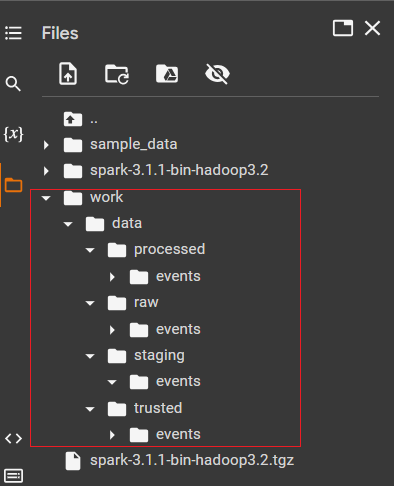

# Pismo Recruiting Technical Case

O projeto tem como propósito propor uma solução ao caso técnico descrito em [Desafio_-_Engenheiro_de_Dados.pdf](https://github.com/eder1985/pismo_recruiting_technical_case/blob/main/docs/Desafio_-_Engenheiro_de_Dados.pdf).

## 1. Considerações sobre o ambiente de trabalho
*Utilizei o Google Colab para criar o notebook da solução. A facilidade para instalar as dependências e vincular o código do notebook ao Github foi decisivo para a escolha. Meu ambiente de trabalho contou ainda com:*
- *Java 8 OpenJDK*
- *Python 3.10.6*
- *Spark v3.1.1 com binário Hadoop 3.2.*

*Como repositório dos dados (fonte e destino) para utilização ao longo do processo, é utilizada a seguinte estrutura de diretórios:*

- `work/data/raw/events`: bucket dos dados raw. Contém arquivos no formato json resultado do processo de geração de dados fake.
- `work/data/staging/events`: bucket dos dados staging ou dados passageiros. Contém os arquivos com os dados brutos em um formato parquet, mais otimizado para aplicar as transformações. É a fonte de dados da pipeline que moverá dados para a camada trusted.  
- `work/data/trusted/events`: bucket dos dados transformados. Os dados estão particionados por event_type e dia e estão no formato parquet. Não há dados duplicados e os dados estão devidamente tipados.
- `work/data/processed/events`: bucket dos dados raw já processados. Contém arquivos .json que já foram processados na camada raw e staging e já chegaram na camada final trusted.

    
***Obs.1:** O código-fonte do teste encontra-se em repositório Github https://github.com/eder1985/pismo_recruiting_technical_case. Já o código-fonte do notebook pode ser acessado diretamento na url https://github.com/eder1985/pismo_recruiting_technical_case/blob/main/work/notebooks/Colab_Pismo_Recruiting_Technical_Case.ipynb*.

***Obs.2:** A instalação das dependências e da criação dos diretórios de trabalho, necessárias para o ambiente de trabalho, são executados e criadas no início do notebook.*

## 2. Solução

### 2.1 Cenário proposto

### 2.2 Simulação de Cenário proposto

*Para atender ao cenário proposto, utilizei a lib [Faker](https://faker.readthedocs.io/en/master/). 
Segue abaixo maiores detalhes:*
- *Para o campos `event_id`, utilizei o método nativo da lib Faker para geração de **uuids únicos**. Visando atender o cenário de event_id duplicados, também criei uma classe Provider customizada gerando apenas 3 valores uuid;*
- *Para o campo `timestamp`, utilizei o método nativo da lib Faker e a classe datetime para gerar timestamps dos últimos 3 anos;*
- *Para o campos `event_type`, criei uma classe Provider customizada gerando apenas 2 tipos de event_type: `account-status-change` e `transaction-new-value`;*
- *Para o campo `domain`, seu valor é gerado a partir do split na string do event_type, para gerar um dado com sentido: domain `account` será vinculado apenas com event_type `account-status-change` e domain `transaction` somente com event_type `transaction-new-value`;*
- *Para o campo `data`, criei uma função `custom_data(fake:Faker)` que retorna um dicionário com 2 schemas diferentes para cada event-type. Para o subcampo status, criei uma classe Provider customizada. Para os outros subcampos, utilizei os métodos nativos da lib Faker;*
- 3 funções criadas:
    - A função `write_fake_data()` com parâmetros de entrada:       
        - `fake:Faker` -> objeto Faker
        - `length:str` -> número de jsons `event` que deseja gerar no arquivo
        - `destination_path:str` -> path onde será salvo o arquivo .json gerado
        - `unique_uuid:bool` -> booleano que indica se o arquivo gerado conterá somente event_ids com uuids únicos. Valor default True.
    - A função `read_fake_data()` com o parâmetro de entrada:
        - `json_filepath` -> path onde será lido os arquivos .json gerados.
    - A função `run` como função principal

*Os arquivos são gerados com um rótulo fake_events_timestamp com o timestamp do momento em que são gerados. Abaixo, exemplo dos arquivos .json gerados:*

### 2.3 Desafio proposto

### 2.4 Proposta de pipeline ao desafio proposto

*O pipeline segue os seguintes passos:*

- *Passo 1: Usando Spark, faz-se a leitura dos dados brutos em formato json, hospedados na camada raw;*
- *Passo 2: Usando Spark, faz-se a escrita dos dados brutos em formato parquet na camada staging. A motivação está no fato do formato parquet ser mais apropriado para aplicar as transformações necessárias;*
- *Passo 3: Usando Spark, faz-se a leitura dos dados brutos em formato parquet na camada staging;*
- *Passo 4: Usando Spark, aplica-se as transformações necessárias aos dados;*
- *Passo 5: Usando Spark, faz-se a escrita dos dados transformados em formato parquet, particionando por tipo de evendo e dia, na camada trusted;*
- *Passo 6: Faz-se operação de movimentação dos arquivos brutos processados da camada raw para a camada processed. Também faz-se a limpeza dos dados da camada staging.*

*Maiores detalhes do fluxo desse pipeline são descritos no próprio notebook.*

## 3. Referências Bibliográficas

- https://faker.readthedocs.io/en/master/index.html
- https://sparkbyexamples.com/
- https://stackoverflow.com/